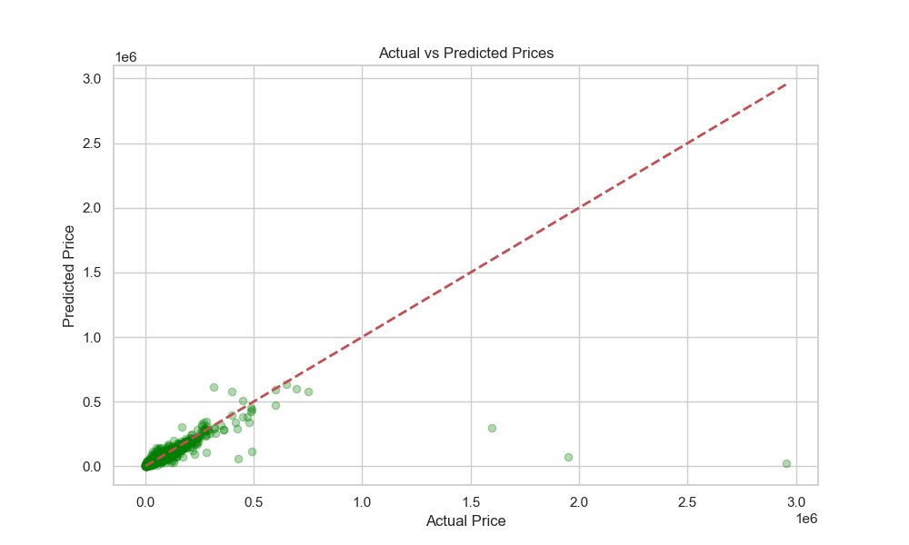
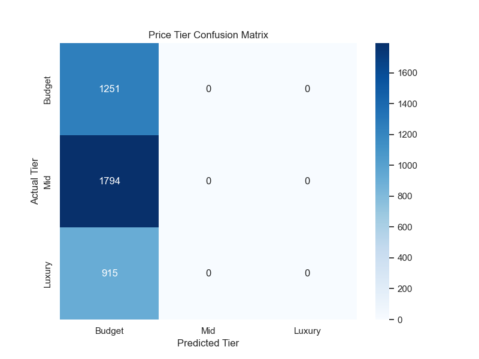
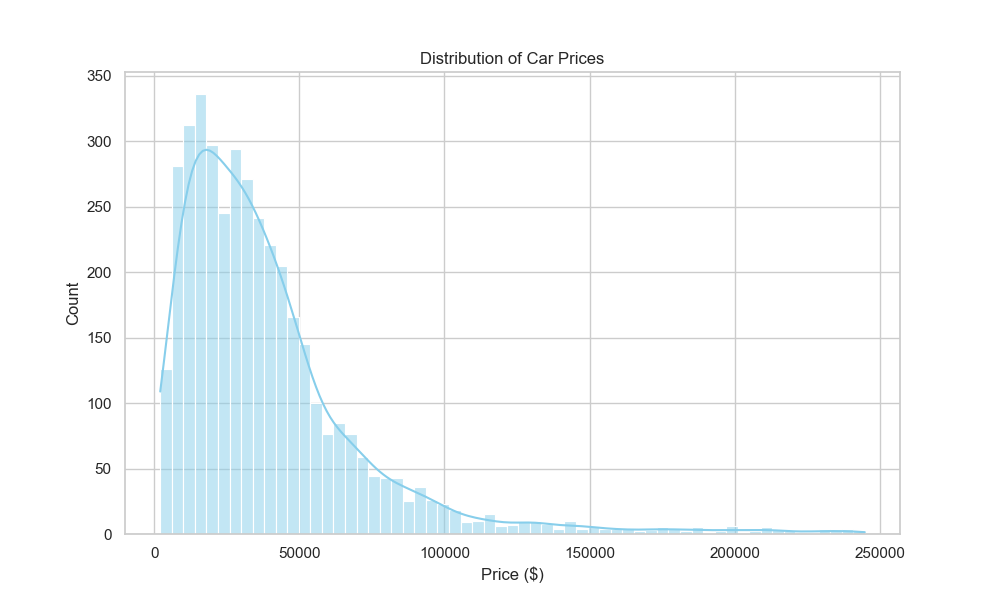
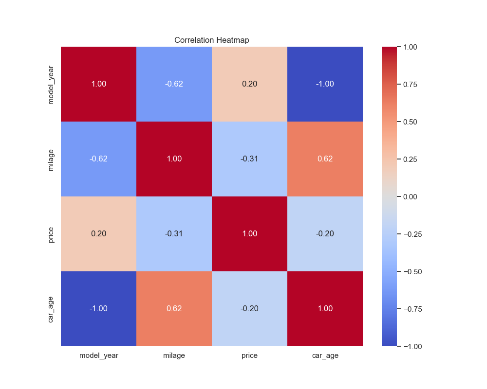
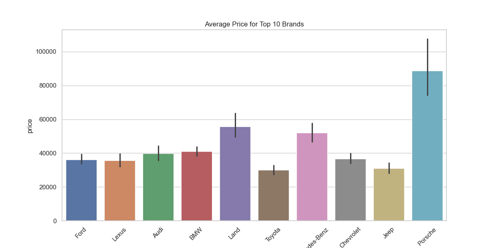

# Data Science Project: Used Car Price Prediction

## Project Description
This project focuses on analyzing a dataset of used cars and building a machine learning model to predict their selling prices. It covers the complete data science pipeline from data preprocessing to visualization and prediction.

## Objective
To understand data analysis, visualization, and machine learning by applying them to a real-world dataset of vehicle listings.

## Learning Outcomes & Skills
• Data Cleaning and Preprocessing using NumPy and Pandas
• Data Visualization using Seaborn and Matplotlib
• Feature Engineering (Age derivation and unit conversion)
• Building Machine Learning Models (Random Forest Regression)
• Model Evaluation using Mean Absolute Error and R² Score

## Steps Followed
1. **Data Collection**: Loaded the `used_cars.csv` dataset.
2. **Data Cleaning**: Parsed price/mileage strings and handled missing values in accident history.
3. **Data Visualization**: Created graphs like histograms for prices, scatter plots for mileage, and brand-wise bar plots.
4. **Feature Engineering**: Created new features like `car_age` from the model year.
5. **Model Building**: Used Random Forest Regressor to predict market values.
6. **Evaluation**: Checked prediction error margins (MAE) and model variance (R²).

## Features Used
• model_year (Car Age)
• milage
• brand
• fuel_type
• accident (Accident History)

## Machine Learning Model
**Random Forest Regressor** was used to predict the car prices based on input features, providing a robust approach to handling the non-linear relationships in automotive pricing.

## Results
The model achieved a Mean Absolute Error of around $21,000. It successfully identified that car age and mileage are the most influential factors, though luxury brand equity also significantly impacts the price.

### Visual Evaluation

*Figure 1: Comparison between actual car prices and model predictions.*

*Figure 2: Confusion Matrix for Price Tiers (Budget, Mid, Luxury).*

## What to Submit
• Dataset used (`used_cars.csv`).
• Python code for preprocessing (`preprocess.py`), visualization (`visualize.py`), and model building (`train_model.py`).
• Screenshots of graphs:
  - 
  - 
  - 
• Final report/explanation explaining the project and results.

## Tips for Students
• Focus on understanding each step rather than memorizing code.
• Visualize data to find outliers before building the model.
• Keep your data cleaning logic robust for handling real-world text data.
• Explain your results clearly in simple language.

## Conclusion
This project demonstrates how data science techniques can be used to extract insights and make predictions in the used car market. It provides a complete understanding of the data science workflow from raw data to a functional model.
